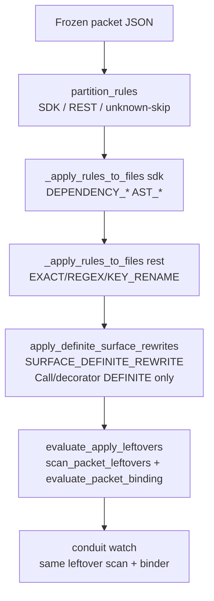

# How Conduit applies packet AST rewrites (import + config plug-in map)

Senior-engineer onboarding for the import-list / nested-config arena. Code paths below are under `conduit-live-llm-mint/` (the tree that carries the surface binder). Dual schema copies: `schema/conduit-packet.schema.json` and `conduit/schema/conduit-packet.schema.json`.

### Overview

`conduit apply` never invents rules. It consumes a **frozen packet JSON**: closed schema (`additionalProperties: false`, closed `rules[].oneOf`), then a second closed set in the apply engine (`SDK_RULE_TYPES` / `REST_RULE_TYPES` + `engine.py` elif). Unknown types are **silently skipped** (`partition_rules` → skip warning).

Today’s mechanical story for SDK migrations:

1. Mint/normalize → validate → freeze packet.
2. Apply: partition SDK → REST → per-file transformers → synthetic **surface CALL pass** → leftover + binder gate.
3. Watch: same leftover scan (`AST_CALL_REWRITE.old_callee` only) + surface completeness.

`AST_IMPORT_REWRITE` rewrites **module paths** (plus an unsafe string fallback). It does **not** walk `from … import` name lists. Nested `class Config` / class-body assigns have **no** rewriter. Multi-name import rename and nested config transforms must plug in as packet-driven rule types (or an honest extension of import rewrite)—never `if package == "pydantic"` in core.

### Key Concepts

| Concept | Meaning |
|--------|---------|
| Frozen packet | Apply contract. Fields on `AST_IMPORT_REWRITE`: opaque `old_import` / `new_import` strings (`$defs/ast_import_rewrite`). |
| Rule stages | `conduit/patcher/rule_stages.py`: `SDK_RULE_TYPES` (deps + AST_*), `REST_RULE_TYPES` (string/regex/`KEY_RENAME`), `POST_RULE_TYPES`. `rule_stage` → `None` ⇒ skipped. |
| Import rewrite | `conduit/patcher/ast_import_rewrite.py` → `_ImportRewriteTransformer`. `leave_Import` rewrites module aliases; `leave_ImportFrom` rewrites **module only**—never `names` / `ImportAlias`. |
| Call rewrite | `AST_CALL_REWRITE` via `ast_attr_call.py` (`leave_Call`). Text mop-up uses `_text_mop_up` with **`old in new` guard**. Decorators that are Calls are rewritten; import clauses are not. |
| Surface binder | `conduit/surface/*`. Only `AST_CALL_REWRITE` compiles to contracts (`contracts_from_packet`). Proof-eligible when nested `surface` / `spellings` / `export_path` present. |
| `SURFACE_DEFINITE_REWRITE` | **Synthetic** change-record type from `apply_definite_surface_rewrites`—not in schema `oneOf`, not in `SDK_RULE_TYPES`. Call/decorator chains only. |
| Leftovers | `scan_leftovers` / `scan_packet_leftovers`: leftover = `ast.Call` whose callee matches a packet `AST_CALL_REWRITE.old_callee` (plus optional export-delta / version-guard arms). **Not** `old_import`, unused import names, or `class Config`. |
| Completeness | `evaluate_binding` over Call + decorator **uses** indexed by `index_python`. Unused import aliases are in `FileIndex.aliases` but never observed as uses → status can be `complete` with a dirty combined import. |
| `side_effects` | Checklist only (`kind` ∈ webhook\|database\|config\|other). Not executed. Mint prompts push multi-statement / config-shaped gaps here. |
| Oracle tokens | `oracle_forbidden_tokens` in `test_gen.py` *does* include `old_import` for generated leftover-token tests—orthogonal to Watch’s call-only leftover scanner. |

### How It Works

#### Mint → freeze

1. LLM (or hand author) emits rules; `normalize_llm_rule` strips to `_LLM_RULE_ALLOWED_KEYS` (`packet/synthesize.py`). For imports that allowlist is `{type, target_files, old_import, new_import, reason}`—no name-list fields.
2. `normalize_llm_rules` → `enrich_minted_rules` (`surface/mint_surface.py`) injects binder-aligned `surface` floors on `AST_CALL_REWRITE` only.
3. Schema validate; packet is frozen. Apply does not remint.

Live mint often emits full import **statements** as `old_import`/`new_import`. Hop smokes sometimes emit clause **fragments** (e.g. `BaseModel, validator`) so the string fallback can hit—workaround, not engine semantics.

#### Apply pipeline

Entry: `apply_packet` in `conduit/patcher/engine.py`.

- SDK/REST: for each rule, elif dispatch. `AST_IMPORT_REWRITE` → `apply_import_rewrite` → language registry → Python `rewrite_python_imports`.
- After SDK+REST (when `stages` includes sdk): `apply_definite_surface_rewrites` rebinds the tree, rewrites **DEFINITE** observations only via libcst `_ChainRewriteTransformer.leave_Call` (any `Call`, including Call-shaped decorators). Non-call decorator names are out of scope; bare-name decorators rely on the earlier `AST_CALL_REWRITE` pass / mop-up.
- Post-apply gate: `evaluate_apply_leftovers` (`patcher/leftovers.py`)—leftover calls and/or binder `incomplete`/`unverified` fail-close (unless pin-only / allow-partial).

#### Import rewrite mechanics (today)

`rewrite_python_imports`:

1. Fast reject if `old_import not in content`.
2. Parse with libcst; visit `_ImportRewriteTransformer`.
3. If `transformer.changes == 0` but `old_import in content` → **raw `str.replace`** with **no** `old in new` guard (unlike CALL mop-up).

`leave_ImportFrom` (actual behavior, despite the comment at L48–49 claiming name rewrite):

- Exact module match → replace module node.
- Prefix/suffix module-path rewrite when `old_import` is a module prefix of the dotted module.
- **Does not** iterate `updated_node.names`.

**Concrete miss:** source `from pydantic import BaseModel, validator` + rule `old_import="from pydantic import validator"` → AST module path ≠ full statement, substring miss on the combined line → after `AST_CALL_REWRITE` turns `@validator` into `@field_validator`, the import clause can stay dirty. Fragment `old_import` can make the string fallback succeed; re-apply stays idempotent for that fixture only.

#### Watch / leftovers / completeness

Shared leftover scan: `scan_packet_leftovers` → `collect_package_calls` (Call chains rooted on package / imported names) → `scan_leftovers` matching **only** `AST_CALL_REWRITE.old_callee`.

Watch (`conduit/watch.py` `evaluate_watch`):

- Pin ≥ `to_version` + leftovers → `bump_dirty` (exit 1).
- Else binder `binding_blocks_complete` → `incomplete` / `unverified` (exit 1).
- Else clean / pre_bump / no_rules / no_pin as documented on the function.

Binder index (`surface/index.py`):

- `_collect_aliases` records Import/ImportFrom locals → origins.
- `_collect_uses` records **Call** and **decorator** chains only.
- `_collect_bases` walks **module-level** `ClassDef` bases only—no nested `class Config`, no class-body `Assign`.

So: unused or half-migrated import names never become observations; completeness can read `complete` while imports and Config residue remain. Existing smokes assert `class Config` residue (`tests/test_pydantic_validator_smoke.py`).

#### Family map (what each type can touch)

| Type | Stage | Touches | Config / multi-import? |
|------|-------|---------|------------------------|
| `AST_IMPORT_REWRITE` | sdk | Module paths (+ unsafe string fallback) | No name-level |
| `AST_CALL_REWRITE` | sdk | Call chains + guarded mop-up | Decorator Call yes; import no |
| `AST_ATTR_RENAME` | sdk | Attribute chains | Not `orm_mode = True` Assign |
| `AST_PARAM_RENAME` | sdk | Call kwargs near `function_target` | Schema-legal `function_target="Config"` is the wrong shape for class body (seen in author CLI tests)—do not overload for Config |
| `KEY_RENAME` | rest | Quoted JSON/YAML/env keys | Not unquoted class assigns |
| `SURFACE_DEFINITE_REWRITE` | synthetic | Call chains from DEFINITE binder hits | No Import / ClassDef |
| `side_effects` | n/a | PR checklist | Config prose today |

There is **no** `leave_ClassDef` / class-body Assign rewriter under `conduit/patcher/`.

#### Where multi-name import rename and nested config must plug in

Facts (not design choices):

1. **Name-level import** — Extend `_ImportRewriteTransformer.leave_ImportFrom` to walk `ImportAlias` (rename / drop / split). Schema + `_LLM_RULE_ALLOWED_KEYS` + `scope.py` `_OLD_TOKEN_KEYS` may need module+names (or a sibling rule type). Kill or tightly limit string fallback for short identifiers (`validator` ⊂ `field_validator`). Optional leftover/Watch arm for ImportFrom names if the oracle should see dirty imports.
2. **Nested config** — New SDK rule type: schema `$defs` + `SDK_RULE_TYPES` + `engine.py` elif + libcst ClassDef/Assign surgery. Packet carries class name + key map + target assignment form; uncodable keys stay `side_effects`. Do **not** alias onto `AST_PARAM_RENAME`.
3. **Mint** — Prompts currently route config-shaped / multi-statement gaps to `side_effects` (`_EVIDENCE_SYSTEM` in `synthesize.py`). Mechanical subset needs prompt reverse + allowlist/dedupe/`scope.py` tokens.
4. **Idempotency** — Name rewrite must be AST-driven; bare substring is unsafe when old is a substring of new.
5. **No package branch** — Packet fields encode the transform; core stays package-agnostic (pydantic only in examples/smokes).

Open product questions (arena): extend `AST_IMPORT_REWRITE` vs sibling type; one inner-class→assignment rule vs many key rules + residual `side_effects`; whether leftovers/Watch grow import-name/Config oracles; split-import when one name moves modules; forbid minting fake Config via `AST_PARAM_RENAME`.

### Where Things Live

| Concern | Path / symbol |
|---------|----------------|
| Schema import rule | `schema/conduit-packet.schema.json` → `$defs/ast_import_rewrite` (dual copy under `conduit/schema/`) |
| Stage partition | `conduit/patcher/rule_stages.py` → `SDK_RULE_TYPES`, `partition_rules` |
| Apply orchestration | `conduit/patcher/engine.py` → `apply_packet`, `_apply_rules_to_files` |
| Import AST | `conduit/patcher/ast_import_rewrite.py` → `_ImportRewriteTransformer`, `rewrite_python_imports` |
| Call / attr AST | `conduit/patcher/ast_attr_call.py` → `_CallRewriteTransformer`, `_text_mop_up` |
| Param rename | `conduit/patcher/ast_param_rename.py` → `_ParamRenameTransformer` (Call kwargs) |
| Surface rewrite pass | `conduit/surface/rewrite.py` → `apply_definite_surface_rewrites` |
| Surface contracts | `conduit/surface/contracts.py` → `contracts_from_packet` (`AST_CALL_REWRITE` only) |
| Index / bases | `conduit/surface/index.py` → `_collect_aliases`, `_collect_bases`, `_collect_uses` |
| Bind / completeness | `conduit/surface/bind.py` → `bind`, `evaluate_binding` |
| Packet binding entry | `conduit/surface/evaluate.py` → `evaluate_packet_binding`, `binding_blocks_complete` |
| Leftover scan + apply gate | `conduit/patcher/leftovers.py` → `scan_leftovers`, `scan_packet_leftovers`, `evaluate_apply_leftovers` |
| Watch | `conduit/watch.py` → `evaluate_watch` |
| Call collection | `conduit/export_delta/usage.py` → `collect_package_calls` |
| Mint normalize / allowlist | `conduit/packet/synthesize.py` → `_LLM_RULE_ALLOWED_KEYS`, `normalize_llm_rule`, `_EVIDENCE_SYSTEM` |
| Mint surface floor | `conduit/surface/mint_surface.py` → `enrich_minted_rules` |
| Scope tokens | `conduit/packet/scope.py` → `_OLD_TOKEN_KEYS` |
| Generated token oracle | `conduit/test_gen.py` → `oracle_forbidden_tokens` (includes `old_import`) |

### Gotchas

1. **Two closed sets.** Schema-valid ≠ applied. New rule types need schema **and** `SDK_RULE_TYPES`/`REST_RULE_TYPES` **and** an `engine.py` branch, or they disappear into `unknown rule type skipped`.
2. **Import comment lies.** `leave_ImportFrom` comments suggest name rewrite; implementation is module-path only. Trust the code.
3. **Import string fallback is unguarded.** CALL mop-up refuses when `old in new`; import fallback does not—dangerous for short identifiers if you lean on substrings.
4. **Leftover ≠ oracle_forbidden_tokens.** Watch/apply leftovers are call-only. Generated leftover-token tests may still flag `old_import` strings. Do not conflate the two gates.
5. **Completeness is call/decorator-shaped.** Dirty `from pkg import A, B` and nested `class Config` do not block `complete`. CI Watch demos that gate on leftover exit code / CALL presence will stay green with dirty imports.
6. **`SURFACE_DEFINITE_REWRITE` is not a packet rule.** It cannot express import or Config obligations; it only executes DEFINITE call-chain hits from contracts derived from `AST_CALL_REWRITE`.
7. **Do not overload `AST_PARAM_RENAME` for Config.** `function_target` matches Call func chains, not nested class bodies. Mint/author fixtures that set `function_target: "Config"` for `orm_mode` are schema-legal and semantically wrong for class-body migration.
8. **`KEY_RENAME` is REST-quoted.** Unquoted `orm_mode = True` inside a class is out of scope.
9. **Packet-driven, not package-driven.** Any pydantic-shaped fix belongs in packet rules (or examples), not core `package ==` branches.
10. **Hop fragment workaround is not general.** Emitting clause fragments so `str.replace` hits multi-name imports papers over the missing ImportAlias walk; name-level work must be AST for idempotency.
